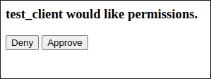

To help you get started, we've provided a working example of aioauth integrated into a minimal FastAPI server using an in-memory database. While the example is intentionally simple, it demonstrates a fully functional flow and can serve as a solid foundation. You can later adapt and extend it into a full production-ready solution tailored to your needs.

### Installation

```bash
$ git clone git@github.com:aliev/aioauth.git
$ cd aioauth/examples
$ pip install -r requirements.txt
$ python3 fastapi_example.py
```

### Testing

Initialize an `authorization_code` request with the example server.

```
http://localhost:8000/oauth/authorize?client_id=test_client&redirect_uri=https%3A%2F%2Fwww.example.com%2Fredirect&response_type=code&state=somestate&scope=email
```

The oauth server authenticates the resource owner (via a login form).


The oauth server then checks whether the resource owner approves or
denies the client's access request.



The oauth server will then generate a response as a redirect to the
specified `redirect_uri` in the initial request. If there is an error
with the initial client request, or the resource owner denies the
request the server will respond with an error, otherwise it will
return a success with a generated "authorization-code"

An error response would look something like this:

```
https://www.example.com/redirect?error=access_denied&state=somestate
```

Whilst a success looks like this:

```
https://www.example.com/redirect?state=somestate&code=EJKOGQhY7KcWjNGI2UbCnOrqAGtRiCEJnAYNwYJ8M5&scope=email
```

The client can then request an access-token in exchange for the
authorization-code using the servers token endpoint.

```bash
curl localhost:8000/oauth/tokenize \
    -u 'test_client:password' \
    -d 'grant_type=authorization_code' \
    -d 'code=EJKOGQhY7KcWjNGI2UbCnOrqAGtRiCEJnAYNwYJ8M5'\
    -d 'redirect_uri=https://www.example.com/redirect'
```

The server then responds with the associated `access_token`, `refresh_token`,
and its relevant data:

```json
{
    "expires_in": 300,
    "refresh_token_expires_in": 900,
    "access_token": "TIQdQv5FCyBoFtoeGt1tAJ37EJdggl8xgSvCVbdjqD",
    "refresh_token": "iJD7Yf4SFuSljmXOhyfjfZelc5J0uIe2P4hwGm4wORCDJyrT",
    "scope": "email",
    "token_type": "Bearer"
}
```

The access-token may be replaced/renewed using the specified `refresh_token`
using the `refresh_token` grant type, which returns the same set of data
before with new tokens.

```bash
curl localhost:8000/oauth/tokenize \
    -u 'test_client:password' \
    -d 'grant_type=refresh_token' \
    -d 'refresh_token=iJD7Yf4SFuSljmXOhyfjfZelc5J0uIe2P4hwGm4wORCDJyrT'
```
